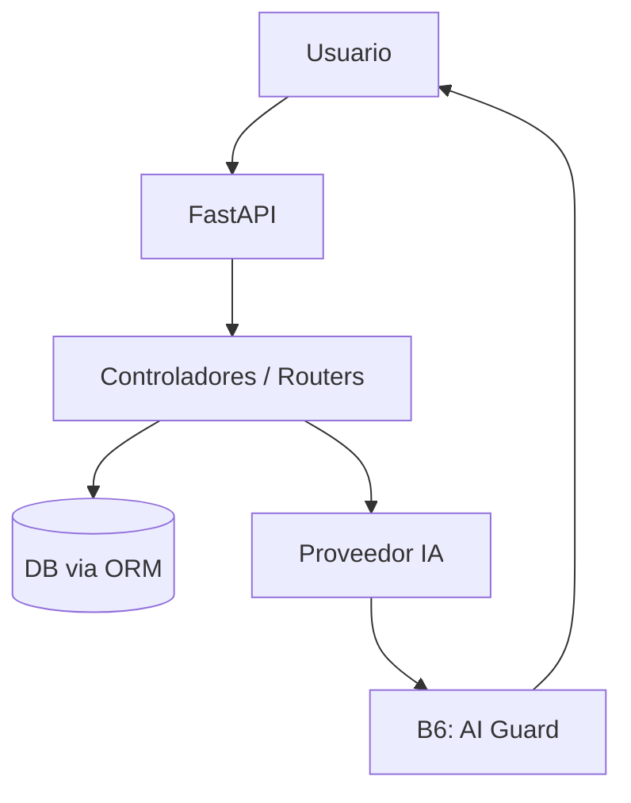

# Bitácora

Bitácora es una plataforma web de aprendizaje abierto para crear rutas de estudio, organizar recursos y gestionar tu progreso técnico.

## Qué es Bitácora

Bitácora ayuda a estudiantes a:

- Planificar rutas de aprendizaje técnico por fases (carreras).
- Importar roadmaps desde archivos Markdown o JSON.
- Gestionar recursos y avances de estudio.
- Conectarse con proveedores de IA (parcial: hoy las claves se guardan en localStorage sin cifrar; el modo hosted con cifrado en servidor es A1, pendiente).
- Usar una base segura con rate limiting, headers de seguridad y cifrado de secretos.

**Lo que todavía no existe:**

- **Chat de IA:** el endpoint devuelve un mensaje estático y no llama a ningún proveedor real. Está pendiente del Bloque C.
- **Laboratorios prácticos:** `static/js/labs.js` tiene datos hardcodeados sin backend (ver deuda técnica).
- **Scraping de contenido educativo** (Bloque D): no construido aún.
- **Generación de contenido con IA** (Bloque C): no construido aún.

## Stack actual

- **Backend:** Python 3.11+ / FastAPI + SQLAlchemy (ORM) + SQLite
- **Frontend:** JavaScript vanilla (HTML/CSS/JS), sin framework
- **Seguridad:** SlowAPI (rate limiting), headers HSTS/X-Frame-Options, cifrado Fernet para API keys en modo hosted
- **Despliegue:** Docker + docker-compose
- **Tests:** pytest (Python) + node:test (JS)

> **Nota:** el stack aspiracional incluye React (A4) y PostgreSQL (A6), pero ninguno de los dos está implementado todavía.

## Estado del proyecto

| Componente | Estado |
|---|---|
| Backend FastAPI + SQLAlchemy | ✅ Funcional |
| Frontend SPA vanilla JS | ✅ Funcional |
| Importador de roadmaps (MD/JSON) | ✅ Funcional (A2 cerrado) |
| Modelo Career multi-carrera | ⚠️ Parcial (falta migración Alembic + test multicareer) |
| Chat de IA | ❌ Mock (devuelve string fijo, no llama a proveedor) |
| B1 — CI/CD (Gitleaks + Trivy) | ✅ Completo |
| B2 — Saneamiento de entrada | ⚠️ Módulos escritos, sin callers reales |
| B3 — Rate limiting | ✅ Completo |
| B4 — Cifrado en reposo | ✅ Completo (con deuda: encryption.py duplicado) |
| B5 — Cabeceras de seguridad | ⚠️ Parcial (falta HTTPS redirect) |
| B6 — Guardián IA | ⚠️ Parcial (ai_guard.py funcional, ai_budget.py sin conectar) |
| Modos API key (A1) | ❌ Sin empezar |
| Migración React (A4) | ❌ Sin empezar |
| Base de datos flexible (A6) | ❌ Sin empezar |

## Arquitectura general



> **Middleware global (envuelve toda la aplicación):**
> - **B5 — Security Headers:** HSTS, X-Frame-Options, X-Content-Type-Options.
> - **B3 — Rate Limiting:** SlowAPI por IP (60/min estándar, 5/min IA).
>
> **Nota sobre el diagrama:** B6.2 (ai_guard.py) enmascara secretos y SQL alucinado en la respuesta de IA. B6.5 (ai_budget.py) está escrito pero no conectado — espera del Bloque C.

## Estructura del repositorio

```text
bitacora/
├── .github/workflows/security.yml
├── app/
│   ├── main.py              # Entrada FastAPI
│   ├── database.py          # Conexión SQLite
│   ├── security.py          # Cifrado de API keys (Fernet)
│   ├── models/
│   │   └── base.py          # SQLAlchemy: Career, Phase, Topic, etc.
│   ├── routers/
│   │   ├── roadmap.py       # CRUD roadmaps + importador
│   │   ├── chat.py          # Chat IA (mock hoy)
│   │   ├── providers.py     # Gestión de proveedores IA
│   │   └── ...
│   └── services/
│       ├── ai.py            # enhance_roadmap_with_ai()
│       └── seed.py          # Seed inicial (placeholder)
├── backend/
│   ├── security/
│   │   ├── ai_guard.py      # Enmascaramiento de secretos
│   │   ├── ai_budget.py     # Presupuesto tokens (sin conectar)
│   │   ├── encryption.py    # Cifrado (duplicado, ver deuda)
│   │   ├── inputs.py        # Sanitización (sin callers)
│   │   └── rate_limit.py    # Límites SlowAPI
│   ├── schemas/
│   │   └── roadmap_import.py
│   └── services/
│       └── roadmap_parser.py
├── static/
│   ├── index.html
│   ├── js/                  # ~24 archivos vanilla JS
│   └── css/
├── tests/
├── docs/
├── Dockerfile
├── docker-compose.yml
├── requirements.txt
├── run.py
├── LICENSE                  # AGPL-3.0
└── NOTICE                   # Copyright del proyecto
```

## Seguridad (Bloque B)

### B1 — CI/CD de seguridad

- Gitleaks para detección de secretos.
- Trivy para vulnerabilidades en dependencias.
- Pipeline bloquea merges ante hallazgos críticos.

### B2 — Saneamiento de entrada

- Módulos escritos: `sanitize_rich_text()` (HTML con allowlist), `secure_image_upload()` (magic bytes + limpieza EXIF).
- **Sin callers reales:** ningún endpoint los invoca hoy. Diferido a Bloques D/E.

### B3 — Rate limiting

- SlowAPI por IP: estándar 60/min, IA 5/min.
- Test de integración verifica que el 429 funciona.

### B4 — Cifrado en reposo

- API keys cifradas con Fernet en modo hosted.
- `BITACORA_MASTER_KEY` define la clave maestra.

### B5 — Cabeceras de seguridad

- HSTS, X-Content-Type-Options: nosniff, X-Frame-Options: DENY.
- Falta redirect HTTPS y gating por APP_ENV (diferido a despliegue).

### B6 — Guardián IA + DB

- **B6.2 (ai_guard.py):** enmascara secretos y SQL alucinado en salida de IA. Funcional.
- **B6.5 (ai_budget.py):** presupuesto de tokens por usuario/sesión. Escrito, no conectado.
- **B6.4 (db_privileges.md):** política documentada, falta implementación SQL + tests.

## Requisitos

- Python 3.11+
- pip
- (Opcional) Node.js — solo para tests JS (`test_provider_connection_flow.js`)

## Instalación rápida

```bash
git clone https://github.com/Josemgu/bitacora.git
cd bitacora
python -m venv .venv
.venv\Scripts\activate        # Windows
# source .venv/bin/activate   # Linux/macOS
pip install -r requirements.txt
copy .env.example .env        # Windows
# cp .env.example .env        # Linux/macOS
mkdir data                    # SQLite almacena aquí la DB
python run.py
```

Abrir en navegador: http://127.0.0.1:8000

**Docker:**

```bash
docker-compose up --build
```

## Variables de entorno

Ver `.env.example` para la referencia completa. Las principales:

```env
BITACORA_MODE=selfhost
DATABASE_URL=                    # Vacío = SQLite local
ENCRYPTION_KEY=                  # Solo en modo hosted
BITACORA_MASTER_KEY=             # Cifrado de secretos
CORS_ORIGINS=http://localhost:8000,http://127.0.0.1:8000
BITACORA_DB_PATH=./data/bitacora.db
TIMEZONE=America/Santo_Domingo
```

## Pruebas

```bash
python -m pytest -q              # Suite Python (~20 tests)
node tests/test_provider_connection_flow.js   # Test JS (opcional)
```

## Documentación adicional

- `00-START-HERE.md` — punto de entrada para continuidad del proyecto.
- `docs/db_privileges.md` — política de mínimo privilegio (stub).
- `SECURITY.md` — política de reporte de vulnerabilidades.

## Deuda técnica conocida

- **api.js vs roadmapApi.js:** wrappers duplicados, decidir cuál se queda.
- **Alembic:** pinneado en requirements, nunca inicializado.
- **labs.js:** datos hardcodeados de plataformas externas (TryHackMe, HTB), sin backend. Verificar licencia antes de Bloque D/E.
- **encryption.py (backend):** duplicado sin caller vs. `app/security.py` que sí se usa.
- **Seed.js:** esquema antiguo (phase_id, una sola carrera).

## Licencia

Bitácora se distribuye bajo **GNU Affero General Public License v3.0** (AGPL-3.0).

Podés usarla, modificarla y compartirla libremente. Si la modificás y la ofrecés como servicio de red, debés publicar tu código modificado bajo la misma licencia.

Ver [LICENSE](LICENSE) para el texto completo y [NOTICE](NOTICE) para el copyright del proyecto.

### Modelo open core

El núcleo de Bitácora es libre bajo AGPL-3.0. Está previsto un módulo comercial cerrado para profesores y estudiantes (gestión de aulas, seguimiento de progreso). Ese módulo debe estar **separado del código AGPL** (comunicándose por API o como plugin) para cumplir con la licencia.