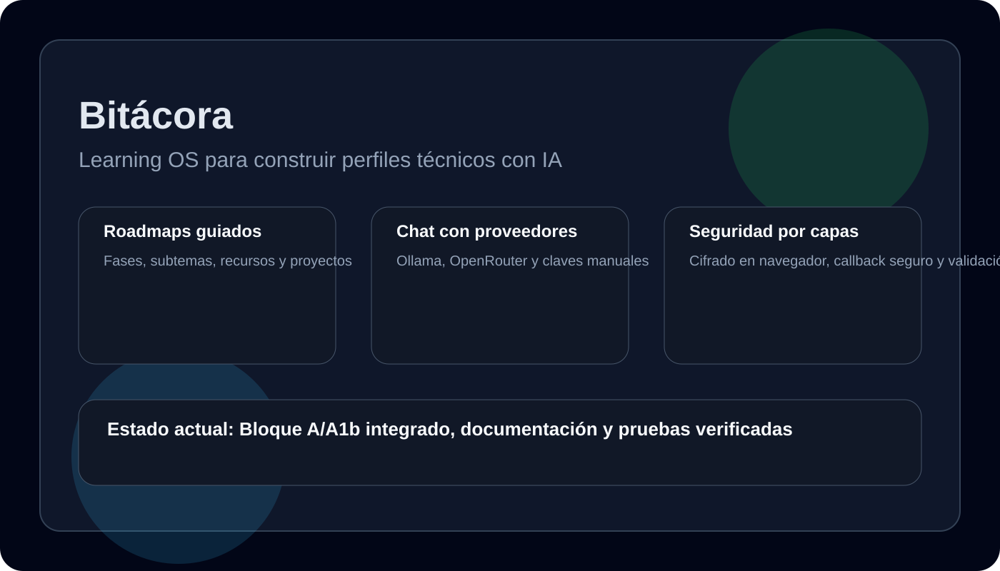
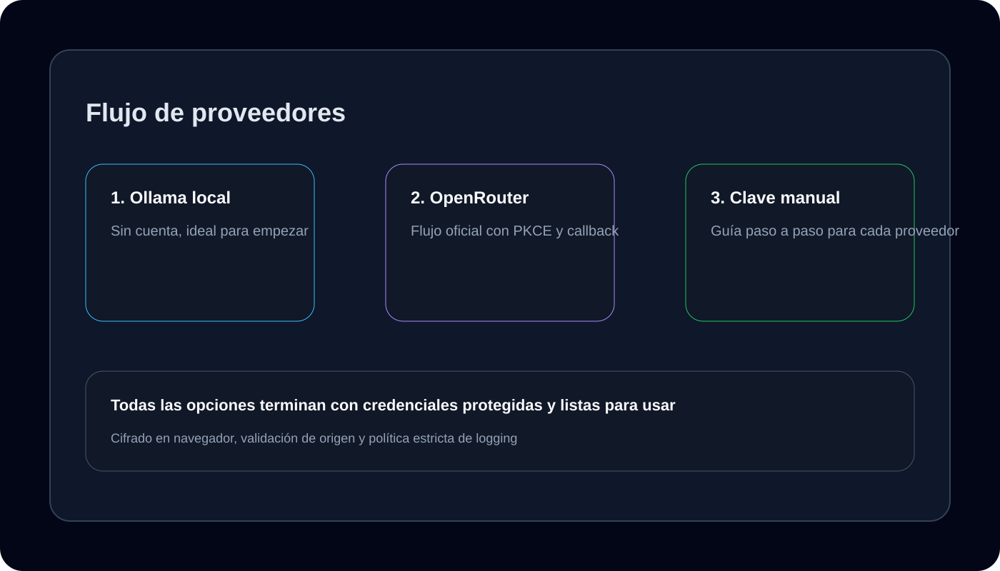

# Bitácora

Bitácora es una plataforma de aprendizaje guiada por IA para construir roadmaps técnicos, consumir recursos confiables y practicar con laboratorios reales desde una experiencia web simple y modular.

> Estado actual: proyecto en desarrollo activo. La base del Bloque A y la integración inicial de proveedores ya están funcionando, pero el endurecimiento completo de seguridad y varias capas de producto siguen en construcción.



## Preview

Estas vistas muestran el estado actual de la aplicación en esta etapa del desarrollo:




## Qué hemos construido

Hasta este punto, el proyecto ya incluye:

- un backend en FastAPI con rutas de configuración y proveedores
- una SPA de frontend en HTML/CSS/JS con panel de configuración y chat
- tres formas de conectar proveedores: Ollama local, OpenRouter y clave manual
- cifrado en navegador para claves de proveedores en modo self-host
- un callback seguro para OpenRouter con validación de origen
- pruebas de regresión para el flujo de conexión y la configuración


## Estado actual del proyecto

### ✅ Implementado

- Panel de configuración con gestión de proveedores
- Integración del chat con selección de proveedor
- Flujo oficial de OpenRouter con PKCE y callback local
- Guardado seguro de credenciales en navegador
- Separación de modos self-host y hosted
- Documentación y variables de entorno actualizadas
- Pruebas de backend y flujo de proveedores verificadas

### 🔄 En progreso

- cierre de la capa de seguridad del Bloque B
- validación adicional de entrada y sanitización de datos externos
- hardening de rate limiting y protección API

### 🚧 En desarrollo

- despliegue de seguridad de nivel producción para el Bloque B
- validaciones más estrictas para entrada externa y archivos
- más pruebas de integración y endurecimiento operativo

## Inicio rápido

```bash
git clone https://github.com/Josemgu/bitacora.git
cd bitacora
pip install -r requirements.txt
copy .env.example .env   # Windows
# o cp .env.example .env   # macOS/Linux
python run.py
```

Abre http://localhost:8000 en tu navegador.

## Stack

| Capa | Tecnología |
|------|-----------|
| Backend | FastAPI + SQLAlchemy + Pydantic |
| Base de datos | SQLite local o PostgreSQL por configuración |
| Frontend | HTML/CSS/JS vanilla |
| Seguridad | Web Crypto AES-GCM en navegador, validación de callback y modo dual |
| Integración IA | Ollama, OpenRouter, OpenAI, Anthropic y Google |

## Estructura del proyecto

```text
bitacora/
├── app/                # Backend FastAPI
├── static/             # Frontend y assets de la SPA
├── tests/              # Pruebas de backend y flujo de proveedores
├── docs/images/        # Imágenes para documentación y GitHub
├── .env.example
├── requirements.txt
└── run.py
```

## Variables de entorno

```env
BITACORA_MODE=selfhost
DATABASE_URL=sqlite:///./bitacora.db
ENCRYPTION_KEY=
CORS_ORIGINS=http://localhost:3000,http://localhost:8000,http://127.0.0.1:8000
```

## Verificación

Ejecuta lo siguiente para validar el estado actual:

```bash
python -m pytest -q
node tests/test_provider_connection_flow.js
```

## Próximos pasos

1. completar las capas del Bloque B de seguridad
2. reforzar sanitización y validaciones de datos externos
3. preparar una segunda ronda de pruebas de integración

## Licencia

MIT
