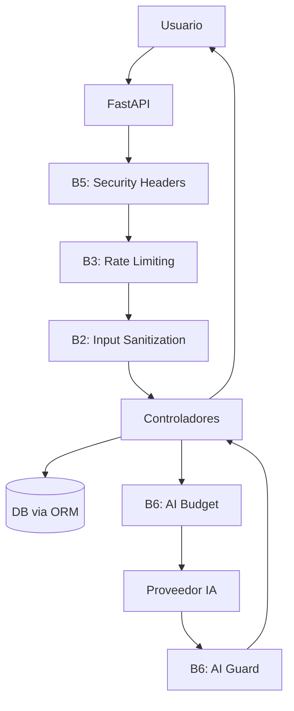

# Bitácora

Bitácora es una plataforma web universitaria de aprendizaje guiado por IA para crear roadmaps, organizar recursos y practicar de forma segura.

Este README resume el proyecto completo: arquitectura, seguridad, estructura, ejecución y pruebas.

## Qué es Bitácora

Bitácora ayuda a estudiantes a:
- Planificar rutas de aprendizaje técnico por fases.
- Gestionar recursos y avances de estudio.
- Conectarse con proveedores de IA de forma controlada.
- Usar una base segura con validaciones y capas de defensa.

## Estado del proyecto

- Backend funcional con FastAPI + SQLAlchemy.
- Frontend SPA en HTML/CSS/JS.
- Bloques de seguridad B1 a B6 implementados y validados con pruebas.

## Arquitectura general



## Estructura del repositorio

```text
bitacora/
├── .github/workflows/security.yml
├── app/
│   ├── main.py
│   ├── database.py
│   ├── models/
│   ├── routers/
│   └── services/
├── backend/security/
│   ├── inputs.py
│   ├── rate_limit.py
│   ├── encryption.py
│   ├── ai_guard.py
│   └── ai_budget.py
├── static/
├── tests/
├── docs/
├── requirements.txt
└── run.py
```

## Seguridad por bloques

### B1 - CI/CD de seguridad
- Gitleaks para secretos.
- Trivy para vulnerabilidades.
- Pipeline bloquea merges ante hallazgos críticos.

### B2 - Saneamiento de entrada
- Sanitización de HTML con allowlist estricta.
- Validación de imágenes por Magic Bytes.
- Limpieza de metadatos EXIF en imágenes.

### B3 - Rate limiting
- Políticas por IP con SlowAPI.
- Límite estándar: 60/minute.
- Límite IA: 5/minute.

### B4 - Cifrado en reposo
- Cifrado de secretos con Fernet.
- Clave maestra por entorno: BITACORA_MASTER_KEY.

### B5 - Cabeceras de seguridad
- Strict-Transport-Security.
- X-Content-Type-Options: nosniff.
- X-Frame-Options: DENY.

### B6 - Guardián IA + DB
- Enmascarado de secretos y SQL alucinado en salida IA.
- Presupuesto de tokens por usuario/sesión para evitar abuso.
- Auditoría ORM sin interpolación SQL insegura.

## Requisitos

- Python 3.11+
- pip
- Node.js (solo para pruebas JS opcionales)

## Instalación rápida

```bash
git clone https://github.com/Josemgu/bitacora.git
cd bitacora
pip install -r requirements.txt
copy .env.example .env
python run.py
```

Abrir en navegador:
- http://127.0.0.1:8000

## Variables de entorno clave

```env
BITACORA_MODE=selfhost
DATABASE_URL=sqlite:///./bitacora.db
ENCRYPTION_KEY=
BITACORA_MASTER_KEY=
CORS_ORIGINS=http://localhost:3000,http://localhost:8000,http://127.0.0.1:8000
```

## Pruebas

Ejecutar suite Python:

```bash
python -m pytest -q
```

Prueba JS de flujo de proveedor (opcional):

```bash
node tests/test_provider_connection_flow.js
```

## Documentación adicional

- 00-START-HERE.md: punto de entrada para continuidad del proyecto.
- docs/db_privileges.md: política de mínimo privilegio en base de datos.

## Licencia

MIT
